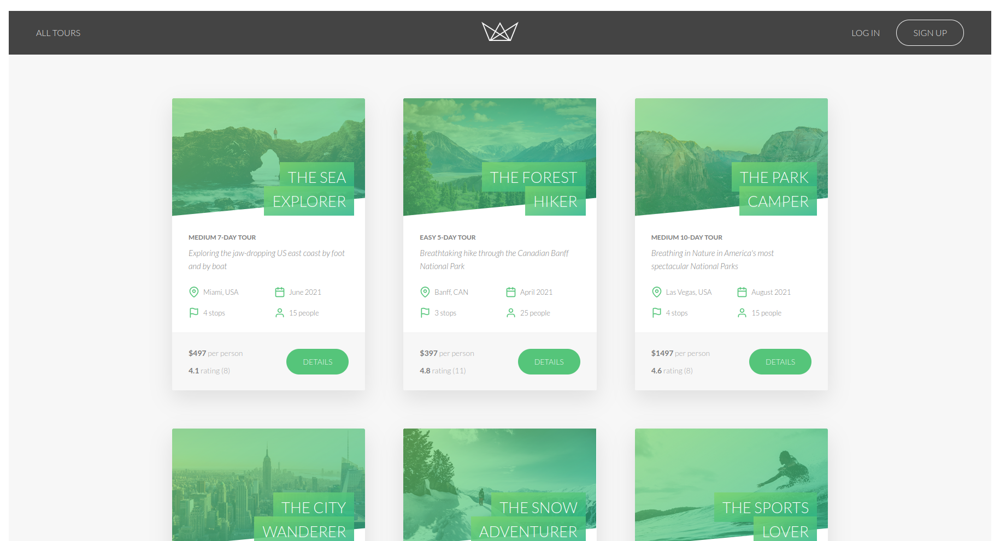
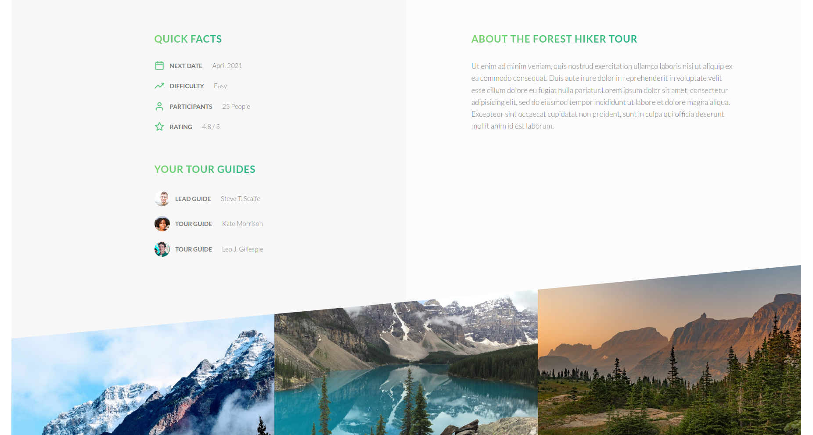
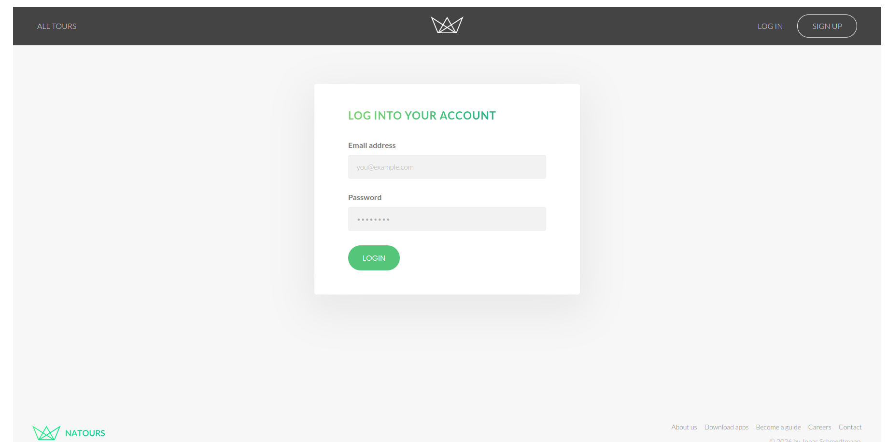
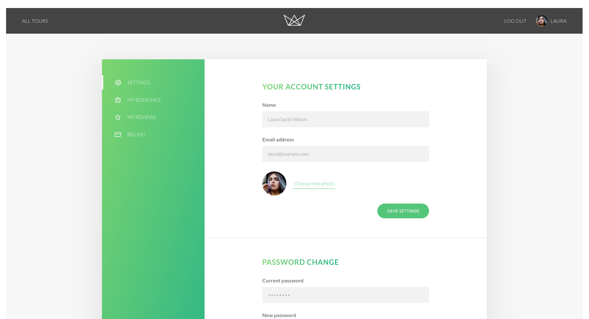
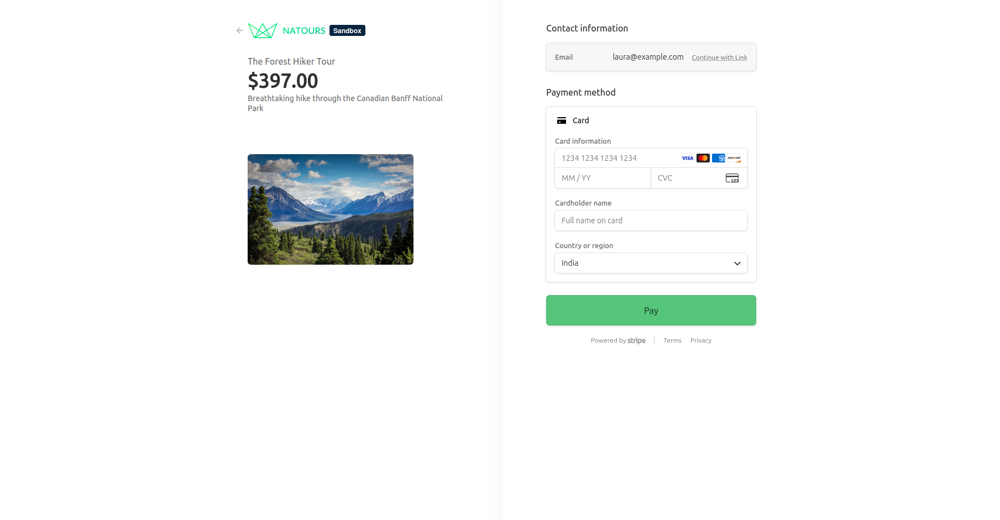

# Natours

A modern full-stack tour booking platform built with **React, Node.js, Express, and MongoDB**. Natours allows users to explore curated travel destinations, securely authenticate, manage their profiles, and book tours through an intuitive and responsive interface.

This project is based on the concepts from Jonas Schmedtmann's Node.js course but has been extended with a completely separate React frontend, improved UI, additional features, and a modern development workflow.

---

## Preview

### Home Page

<p align="center">
  
</p>

---

### Tour Details

<p align="center">
  
</p>

---

### Authentication

<p align="center">
  
  
</p>

---

### User Dashboard

<p align="center">
  
</p>

---

### Interactive Maps

<p align="center">
  
</p>

---

### Booking & Payment

<p align="center">
  
</p>

---

## Features

### User Features

- Browse available tours
- Detailed tour pages
- Interactive maps
- Secure authentication
- JWT-based authorization
- Profile management
- Upload profile photo
- View booked tours
- Book tours online
- Responsive UI

### Admin Features

- Manage tours
- Manage users
- Role-based authorization
- CRUD operations
- Image upload and processing

### Backend Features

- RESTful API
- JWT Authentication
- Password hashing
- Cookie-based sessions
- Global error handling
- Request validation
- Image optimization using Sharp
- MongoDB aggregation pipelines
- Advanced API filtering

---

## Tech Stack

| Frontend | Backend | Database | Other |
|-----------|----------|----------|-------|
| React | Node.js | MongoDB | JWT |
| React Router | Express.js | Mongoose | Multer |
| Axios | REST API | MongoDB Atlas | Sharp |
| CSS | MVC Architecture | | Leaflet |

---

## Project Structure

```
Natours
│
├── client
│   ├── public
│   ├── src
│   │   ├── components
│   │   ├── pages
│   │   ├── services
│   │   ├── hooks
│   │   ├── context
│   │   └── assets
│
├── server
│   ├── controllers
│   ├── models
│   ├── routes
│   ├── middleware
│   ├── utils
│   └── config
│
└── README.md
```

---

## API Highlights

### Authentication

```
POST   /api/v1/users/signup
POST   /api/v1/users/login
GET    /api/v1/users/logout
PATCH  /api/v1/users/updateMe
PATCH  /api/v1/users/updateMyPassword
```

### Tours

```
GET    /api/v1/tours
GET    /api/v1/tours/:id
POST   /api/v1/tours
PATCH  /api/v1/tours/:id
DELETE /api/v1/tours/:id
```

### Reviews

```
GET    /api/v1/reviews
POST   /api/v1/reviews
PATCH  /api/v1/reviews/:id
DELETE /api/v1/reviews/:id
```

### Bookings

```
POST   /api/v1/bookings/create-paypal-order
POST   /api/v1/bookings/capture-paypal-order
```

---

## Installation

Clone the repository

```bash
git clone https://github.com/yourusername/natours.git
```

Move into the project

```bash
cd natours
```

### Backend

```bash
cd server
npm install
```

Create a `.env` file

```env
NODE_ENV=
PORT=

DATABASE=
DATABASE_PASSWORD=

JWT_SECRET=
JWT_EXPIRES_IN=
JWT_COOKIE_EXPIRES_IN=

EMAIL_HOST=
EMAIL_PORT=
EMAIL_USERNAME=
EMAIL_PASSWORD=

PAYPAL_CLIENT_ID=
PAYPAL_CLIENT_SECRET=
```

Run the backend

```bash
npm run dev
```

---

### Frontend

```bash
cd client
npm install
npm run dev
```

---

## Performance

- Responsive across desktop and mobile devices
- Optimized image processing with Sharp
- Secure authentication using JWT
- RESTful API architecture
- Modular and scalable folder structure

---

## Future Improvements

- Stripe integration
- Wishlist functionality
- Tour recommendations
- Email verification
- Forgot password via OTP
- Search and filtering enhancements
- Admin analytics dashboard
- Progressive Web App support
- Add badges (GitHub stars, license, React, Node.js, MongoDB, Express) below the title.
- Include an **Architecture** diagram showing React → Express → MongoDB → PayPal → Leaflet.
- Add a short **"Why this project?"** section explaining the motivation and improvements over the original course project. This gives recruiters context and differentiates your repository.
